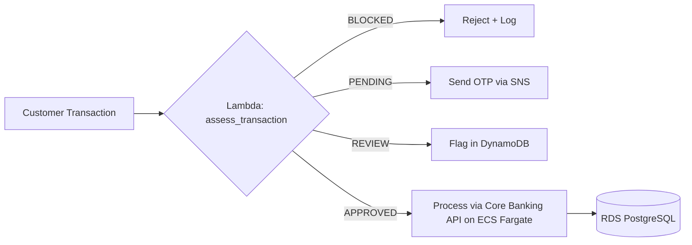

```mermaid
flowchart LR
    A[Customer Transaction] --> B{Lambda: assess_transaction}
    B -- BLOCKED --> C[Reject + Log]
    B -- PENDING --> D[Send OTP via SNS]
    B -- REVIEW --> E[Flag in DynamoDB]
    B -- APPROVED --> F[Process via Core Banking API on ECS Fargate]
    F --> G[(RDS PostgreSQL)]
```